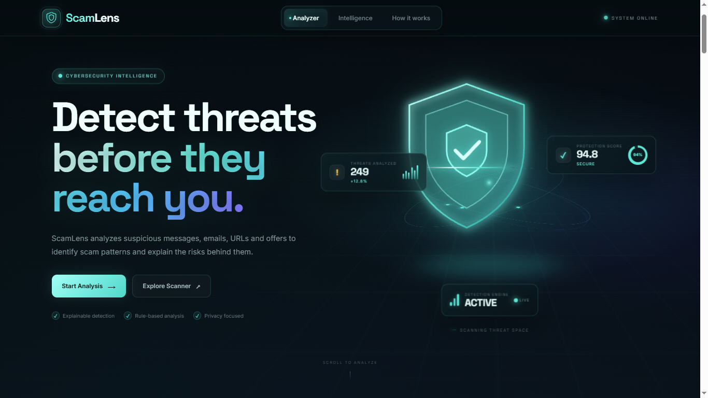
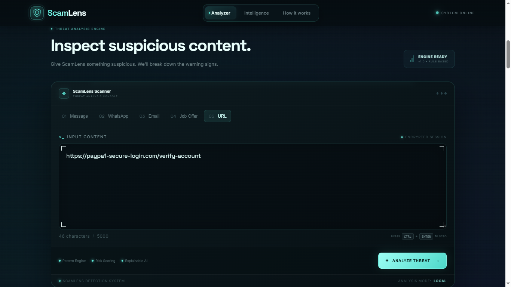
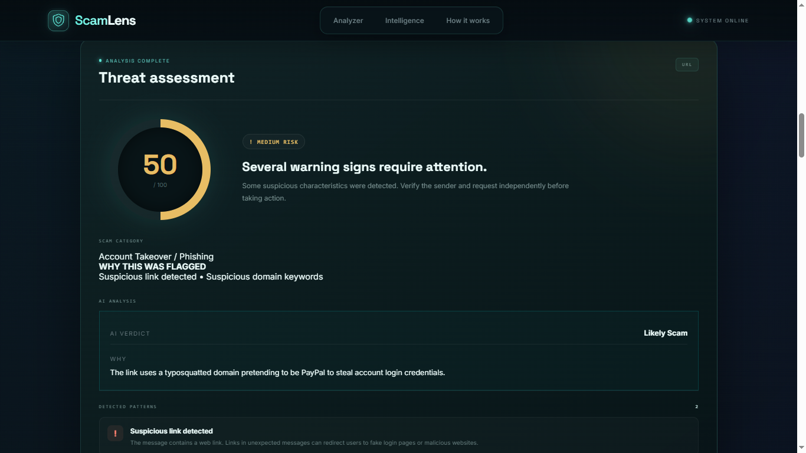
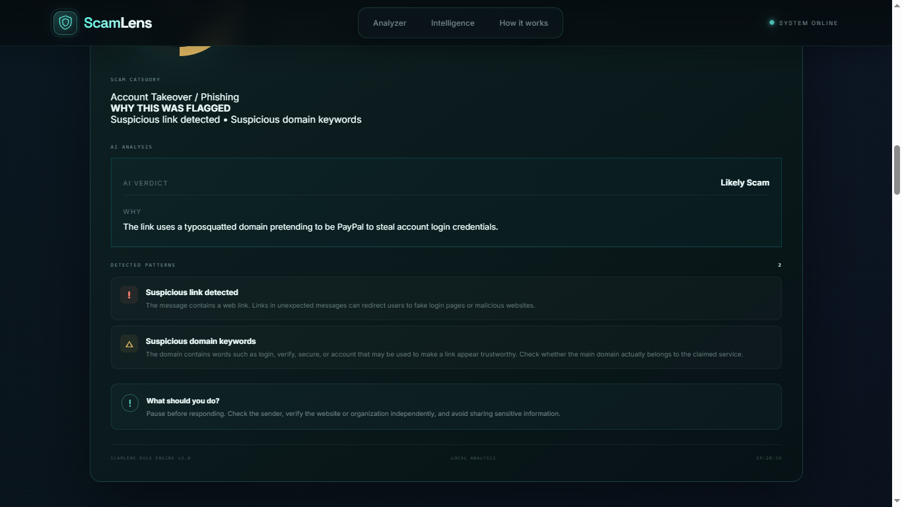
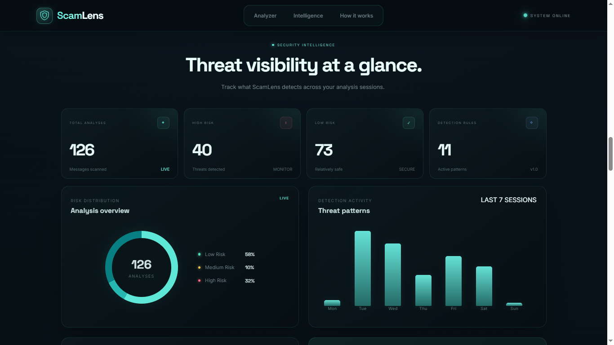
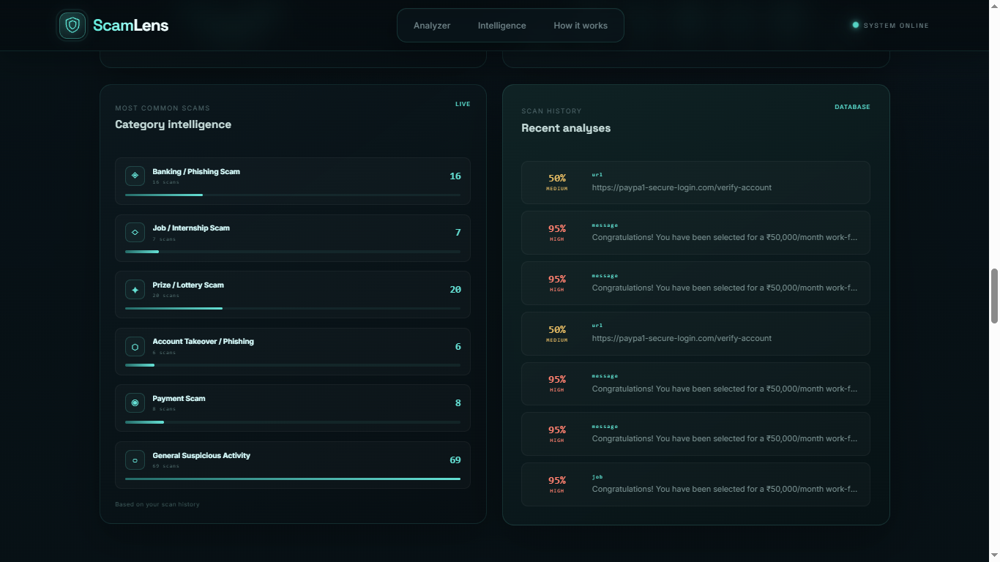
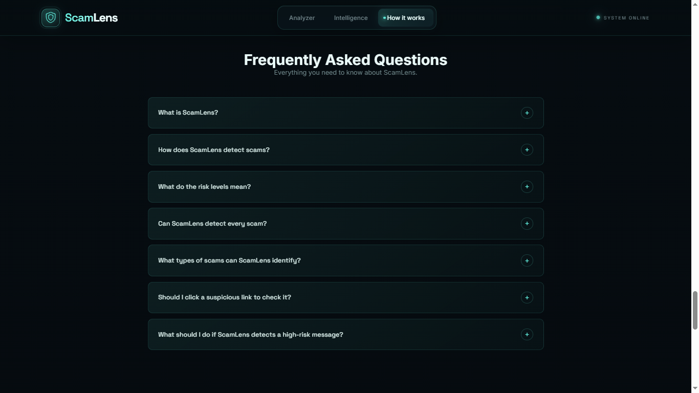
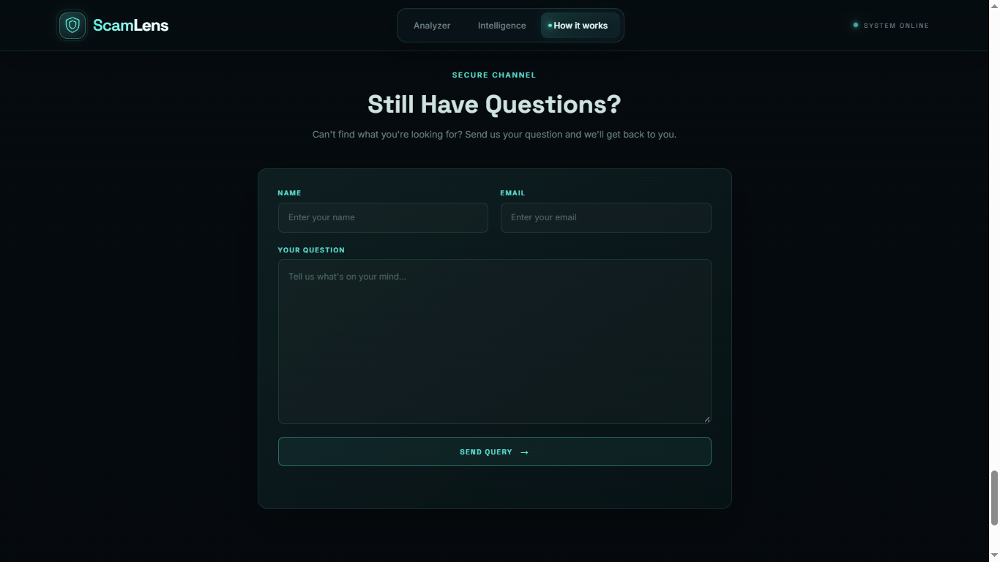
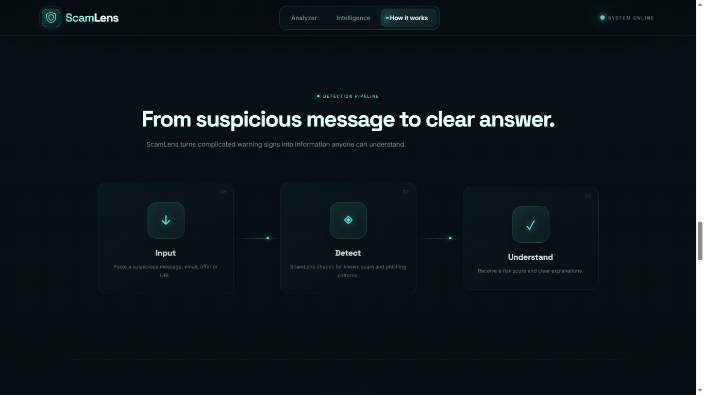

# ScamLens 🛡️

ScamLens is a full-stack web application that I built to detect and analyze potentially suspicious messages and URLs.

The application combines a **rule-based detection system** with **Google Gemini AI** to calculate a risk score, identify scam patterns, classify the type of scam, and explain why the input may be suspicious.

## Live Project

**Frontend:** https://swekshapatil.github.io/ScamLens/

**Backend API:** https://scamlens-backend-0w5v.onrender.com/

---

## What ScamLens Does

A user can enter a suspicious message or URL and get:

* Risk score from **0–100**
* Risk level: **LOW, MEDIUM, or HIGH**
* Detected suspicious patterns
* Scam category
* Explanation of why the input was flagged
* AI-generated verdict and reasoning
* Saved scan history

The project also includes a dashboard that shows scan statistics and category-wise activity.

---

## How It Works

ScamLens uses two layers of analysis.

### 1. Rule-Based Detection

The first layer checks the input for known suspicious patterns such as:

* Urgent or threatening language
* OTP requests
* Password or banking information requests
* Suspicious links
* Account verification requests
* Payment requests
* Fake rewards or prizes
* Job/internship offers asking for money

For URLs, additional checks are performed for things such as:

* IP-based URLs
* URL shorteners
* Suspicious domain structures
* Brand impersonation
* `@` symbols
* Multiple hyphens
* Encoded characters

These detections contribute to the overall risk score.

### 2. AI Analysis

After the rule-based analysis, the input is sent to Google Gemini for contextual analysis.

The AI is used to:

* Classify the main scam category
* Provide an overall verdict
* Give a short reason for the classification

The AI classification considers the overall meaning of the message instead of depending only on individual keywords.

If the AI service is temporarily unavailable, the rule-based analysis still works and the scan can be completed.

---

## Scam Categories

ScamLens currently supports:

* Banking / Phishing Scam
* Job / Internship Scam
* Prize / Lottery Scam
* Account Takeover / Phishing
* Payment Scam
* General Suspicious Activity

---

## Risk Levels

The rule-based engine calculates a score between 0 and 100.

| Risk Score | Risk Level |
| ---------- | ---------- |
| 0–30       | LOW        |
| 31–60      | MEDIUM     |
| 61–100     | HIGH       |

The score is generated by combining the suspicious patterns detected in the input.

---

## Tech Stack

**Frontend**

* HTML
* CSS
* JavaScript

**Backend**

* Node.js
* Express.js
* REST APIs

**Database**

* MongoDB
* Mongoose

**AI**

* Google Gemini API

**Tools**

* Git
* GitHub
* Postman

**Deployment**

* GitHub Pages
* Render

---

## Project Structure

```text
ScamLens/
│
├── Backend/
│   ├── models/
│   │   ├── Scan.js
│   │   └── Query.js
│   │
│   ├── routes/
│   │   ├── scanRoutes.js
│   │   └── queryRoutes.js
│   │
│   ├── services/
│   │   └── aiService.js
│   │
│   ├── server.js
│   ├── package.json
│   └── .env
│
├── Frontend/
│   ├── index.html
│   ├── script.js
│   └── style.css
│
└── README.md
```

---

## API Endpoints

### Scan Input

`POST /api/scan`

Stores a scan and returns the saved result along with the AI analysis.

### Scan History

`GET /api/scan`

Returns previously stored scans.

### Delete Scan

`DELETE /api/scan/:id`

Deletes a specific scan from the database.

### Submit Query

`POST /api/queries`

Stores a question submitted through the query form.

---

## Validation & Protection

I added backend validation and basic API protection, including:

* Maximum input length of **5000 characters**
* Risk score validation between 0 and 100
* Required field validation
* API rate limiting
* Environment variables for sensitive credentials
* `.env` excluded from GitHub
* AI failure handling

---

## Example

### Input

```text
URGENT! Your bank account will be blocked today.
Verify your account immediately by clicking this link
and enter your OTP and banking details.
```

### Result

```text
Risk Score: 100%
Risk Level: HIGH

Category:
Banking / Phishing Scam
```

The result also shows the suspicious patterns detected and the AI analysis.

---

## Dashboard

The project includes a dashboard that displays:

* Total scans
* Risk distribution
* Scam category distribution
* Detection activity
* Scan history

Scan data is stored in MongoDB and loaded through the backend API.

---

## Screenshots

## Screenshots

<table>
  <tr>
    <td></td>
    <td></td>
  </tr>
  <tr>
    <td></td>
    <td></td>
  </tr>
  <tr>
    <td></td>
    <td></td>
  </tr>
  <tr>
    <td></td>
    <td></td>
  </tr>
  <tr>
    <td colspan="2" align="center">
      
    </td>
  </tr>
</table>


---

## Demo

A short demonstration of ScamLens showing the analyzer, risk assessment, scam category, AI analysis, and scan history.

🎥 Project Demo: Watch the ScamLens Demo

---

## Future Improvements

- User authentication
- More advanced URL analysis
- Additional scam categories
- Browser extension support
---

## What I Learned

While building ScamLens, I worked with:

* Frontend and backend integration
* REST API development
* MongoDB and Mongoose
* API testing using Postman
* Environment variables and API keys
* Git and GitHub
* Deploying a frontend and backend separately
* Integrating an AI API into an existing application
* Handling API failures and rate limits

---

## Author

**Sweksha Patil**

Computer Engineering Student

GitHub: https://github.com/swekshapatil

---

## Note

ScamLens is an educational and portfolio project. Its results should not be treated as a definitive determination that a message or URL is fraudulent.
